# Cover Letter Crew

A **CrewAI-powered** app that turns a raw job posting + your CV into **2 polished English cover letters** (formal and modern) with systematic fact-checking to eliminate hallucinations — in about 2 minutes.

Runs entirely on a **free local 7B model** (Ollama) or a **cheap cloud API** (DeepSeek, ~$0.002 per run).

---

## Quick Start

```bash
# 1. Install dependencies
pip install -r requirements.txt

# 2a. Free local option — pull the default model
ollama pull qwen2.5:7b

# 2b. OR cheap cloud option — add your DeepSeek key
echo DEEPSEEK_API_KEY=your_key_here > .env

# 3. Launch the web UI
streamlit run app.py
```

Open `http://localhost:8501` in your browser. On Windows, double-click **Run_Streamlit.bat**.

---

## Features

| Feature | Details |
|---|---|
| Resume upload | Upload PDF, DOCX, or TXT files — text is extracted automatically |
| Raw job paste | Paste the full LinkedIn page — UI noise is stripped by an agent |
| 2 letter variants | EN Formal · EN Modern |
| Fact Checker | Dedicated agent detects hallucinations before the reviewer applies fixes |
| Copy-ready output | Each letter in a code block — select all, Ctrl+C, done |
| Word export | Optional `.docx` download with both variants formatted |
| LLM flexibility | Ollama (local/free) or any cloud API; switch in sidebar at runtime |
| CLI mode | `python cover_letter_crew.py` still works unchanged |

---

## Multi-Agent Architecture & Workflow

The system uses **7 AI agents** across **8 tasks** in a sequential pipeline. The key architectural principle is **detection → correction separation**: a dedicated Fact Checker finds hallucinations first; the Reviewer applies the fixes rather than trying to detect and fix simultaneously.

```mermaid
flowchart TD
    %% ── INPUTS ──────────────────────────────────────────────────
    RAW(["📋 Raw Job Posting\n(paste from LinkedIn / job board)"])
    CV(["👤 Candidate Profile\n(upload PDF · DOCX · TXT\nor paste text)"])

    %% ── STAGE 0 ──────────────────────────────────────────────────
    subgraph S0["⚙️  Stage 0 — Pre-processing  (mini-crew, runs first)"]
        PARSER["🤖 Job Page Parser\n\nStrips: buttons, nav bars, share prompts,\npremium upsells, 'People you may know'\n\nExtracts structured JSON:\n• company_name\n• job_title\n• location\n• ref_number\n• job_description  ← clean text only"]
    end

    RAW --> PARSER
    PARSER --> JOB[/"Structured Job Data\ncompany · title · location · ref · JD text"/]

    %% ── STAGE 1 ──────────────────────────────────────────────────
    subgraph S1["🔍  Stage 1 — Job Analysis"]
        JDA["🤖 Job Analyst\n\nReads the clean JD text\n\nOutputs labelled sections:\nTECHNICAL_REQUIREMENTS  (top 5)\nSOFT_SKILLS  (top 3)\nKEYWORDS  (comma-separated)\nTOOLS_AND_STANDARDS"]
    end

    JOB --> JDA
    JDA --> ANA[/"JD Analysis\n(structured labels for reliable 7B output)"/]

    %% ── STAGE 2 ──────────────────────────────────────────────────
    subgraph S2["🎯  Stage 2 — Profile Matching + Truth Anchor"]
        MATCH["🤖 Profile Matcher\n\nReceives: JD Analysis + Candidate Profile\n\nOutputs labelled sections:\nSTRONG_MATCHES  (4 specific CV ↔ JD links)\nPARTIAL_MATCHES  (adjacent skills + safe framing)\nPROHIBITED_CLAIMS  (must NOT appear in letters)\nSAFE_FRAMING  (exact bridge sentences to use)\nOPENING_HOOK · UNIQUE_ANGLE · AEROSPACE_FLAG"]
    end

    ANA --> MATCH
    CV  --> MATCH
    MATCH --> MA[/"Match Analysis + Truth Boundaries\n(shared context for writers and fact checker)"/]

    %% ── STAGE 3 ──────────────────────────────────────────────────
    subgraph S3["✍️  Stage 3 — Writing (2 agents, both read Match Analysis)"]
        direction LR
        W1["🤖 Formal English Writer\n\nStructured · traditional\n4 paragraphs · flowing prose\nConnector words allowed\n\nSign-off:\nMit freundlichen Grüßen /\nKind regards, [Name]"]
        W2["🤖 Modern English Writer\n\nPunchy · direct\nOpens with strongest hook\nNo filler phrases · em-dashes\n\nSign-off:\nBest regards, [Name]"]
    end

    MA --> W1 & W2

    %% ── STAGE 4 ──────────────────────────────────────────────────
    subgraph S4["🔎  Stage 4 — Fact Checking (NEW)"]
        FC["🤖 Fact Checker\n\nReceives: both letter drafts + Resume Analysis\n+ PROHIBITED_CLAIMS + SAFE_FRAMING\n\nGoes sentence-by-sentence — for every claim:\n  HARD violation → in PROHIBITED_CLAIMS, must remove\n  SOFT violation → adjacent overclaim, weaken\n  CALIBRATION   → language stronger than evidence\n  PASS           → verified against profile ✓\n\nOutputs structured VIOLATION REPORT only.\nDoes NOT rewrite letters."]
    end

    W1 & W2 --> FC
    FC --> VR[/"Violation Report\nEN_FORMAL_VIOLATIONS + EN_MODERN_VIOLATIONS\n+ SUMMARY counts"/]

    %% ── STAGE 5 ──────────────────────────────────────────────────
    subgraph S5["✅  Stage 5 — Review + Polish"]
        REV["🤖 Tone & Grammar Reviewer\n\nStep 1: Apply ALL violations from report (in order)\nStep 2: Fix salutation, language purity\nStep 3: Remove banned AI phrases\nStep 4: Grammar, technical terms\nStep 5: Paragraph depth (min 3 sentences each)\nStep 6: Sign-off completeness"]
    end

    VR --> REV
    W1 & W2 --> REV

    %% ── OUTPUTS ──────────────────────────────────────────────────
    REV --> L1["EN Formal"]
    REV --> L2["EN Modern"]

    subgraph OUT["📤  Output — Streamlit UI"]
        TABS["2 Tabs — one per variant\nEach letter in a copyable code block\n(click · Ctrl+A · Ctrl+C)"]
        DOCX["Optional: Download .docx\nBoth variants in a formatted Word file"]
    end

    L1 & L2 --> TABS
    TABS --> DOCX

    %% ── STYLES ───────────────────────────────────────────────────
    classDef agent  fill:#1F497D,color:#fff,stroke:#0d2d52
    classDef data   fill:#E8F0FB,color:#1a1a2e,stroke:#99b
    classDef output fill:#D6EAD6,color:#1a3a1a,stroke:#6a9a6a
    classDef input  fill:#FFF8E1,color:#333,stroke:#c9a

    class PARSER,JDA,MATCH,W1,W2,FC,REV agent
    class JOB,ANA,MA,VR,L1,L2 data
    class TABS,DOCX output
    class RAW,CV input
```



---

## How Context Flows Between Agents

```
                    [Raw Job Paste]
                          │
                    Job Page Parser
                          │
              [Structured Job Data: company, title, JD text]
                          │
                     Job Analyst
                          │
         [JD Analysis: requirements, skills, keywords]
                          │
                   Profile Matcher ◄─── [Candidate Profile]
                          │
          ┌───────────────┘
          │   PROHIBITED_CLAIMS + SAFE_FRAMING + STRONG_MATCHES
          ▼               ▼
    EN Formal Writer   EN Modern Writer
          │               │
          └───────┬───────┘
                  ▼
            Fact Checker  ◄── PROHIBITED_CLAIMS, SAFE_FRAMING, Resume Analysis
                  │
          [Violation Report: HARD / SOFT / CALIBRATION per letter]
                  │
              Reviewer ◄── both draft letters
                  │
          [Apply fixes → polish → output]
                  │
          ┌───────┴───────┐
    EN_FORMAL_FINAL    EN_MODERN_FINAL
```

The **Fact Checker** is the key architectural addition. It receives the two draft letters and the truth boundaries (PROHIBITED_CLAIMS, SAFE_FRAMING) produced by the Profile Matcher, then produces a structured violation report. The **Reviewer** receives this report and applies every fix before doing grammar and style work — detection and correction are fully separated.

---

## Stage-by-Stage Breakdown

### Stage 0 — Job Page Parser
A lightweight mini-crew that runs **before** the main pipeline. LinkedIn pages contain buttons, nav bars, premium upsells, "People you may know" sections, share/save prompts, etc. This agent strips all of that and returns a clean JSON object with only the actual job content.

### Stage 1 — Job Analyst
Reads the clean job description and produces a structured breakdown using **labelled sections** (`TECHNICAL_REQUIREMENTS:`, `SOFT_SKILLS:`, etc.). The explicit format is enforced so that even a 7B local model produces reliable, parseable output.

### Stage 2 — Profile Matcher + Truth Anchor
Receives both the JD Analysis and the full candidate profile. It produces:
- **STRONG_MATCHES** — specific one-to-one links between CV experience and JD requirements
- **PARTIAL_MATCHES** — adjacent skills with exact safe framing sentences to use
- **PROHIBITED_CLAIMS** — skills, tools, and job titles the JD requires that have NO direct evidence in the profile; writers must not claim these at all
- **SAFE_FRAMING** — for each prohibited or partial item, an exact bridge sentence the writers may use instead
- **OPENING_HOOK** and **UNIQUE_ANGLE** — for writers to use directly

The truth boundaries are enforced by the writers (TRUTH CONSTRAINT rule), verified by the Fact Checker, and applied by the Reviewer — three layers.

### Stage 3 — 2 Writing Agents
Each writer receives the Match Analysis and generates a complete letter body in their assigned style. They are constrained to use only SAFE_FRAMING for gap areas and must not claim anything under PROHIBITED_CLAIMS.

### Stage 4 — Fact Checker (NEW)
Goes sentence-by-sentence through both draft letters. For every claim about a skill, tool, domain, or job title, it checks:
- **Q1**: Is this directly evidenced in the candidate profile?
- **Q2**: If not — is it in PROHIBITED_CLAIMS? → **HARD violation**
- **Q3**: Is it an adjacent domain overclaim without using SAFE_FRAMING? → **SOFT violation**
- **Q4**: Does the language strength match the evidence depth? → **CALIBRATION issue**

Outputs a structured **VIOLATION REPORT** with the exact phrase, reason, and replacement for each issue. Does **not** rewrite letters.

### Stage 5 — Reviewer
Receives the two drafts and the violation report. Applies every HARD, SOFT, and CALIBRATION fix first (in order), then handles grammar, banned phrases, paragraph depth, and sign-off completeness.

---

## Why Separate Detection from Correction?

| Approach | Problem |
|---|---|
| TRUTH CONSTRAINT in writer prompt only | LLM generation instinct overrides it for edge cases |
| Reviewer self-discovers + fixes hallucinations | Shallow detection — reviewer is distracted by grammar/style |
| Dedicated Fact Checker → Reviewer gets explicit report | **Systematic detection, targeted correction** |

The Fact Checker has one narrow job (structured output, no creativity required) — this works reliably on 7B local models. The Reviewer then applies explicit violations rather than trying to discover them independently.

---

## LLM Options

| Provider | `.env` variable | Cost | Speed |
|---|---|---|---|
| **Ollama** (default) | — (no key needed) | Free | ~3–5 min |
| **DeepSeek** | `DEEPSEEK_API_KEY` | ~$0.002/run | ~1–2 min |
| **Claude (Anthropic)** | `ANTHROPIC_API_KEY` | Haiku ~$0.01, Sonnet ~$0.05 | ~1 min |
| **ChatGPT (OpenAI)** | `OPENAI_API_KEY` | 4o-mini ~$0.01, 4o ~$0.05 | ~1 min |
| **Gemini (Google)** | `GOOGLE_API_KEY` | Flash ~$0.01 (free tier quota is very low for 8-call pipelines) | ~1 min |
| **Groq** | `GROQ_API_KEY` | Free tier available | ~30 sec |
| **OpenRouter** | `OPENROUTER_API_KEY` | Many free models | Varies |

The Streamlit sidebar lets you switch provider, pick a model, enter your API key, and tune temperature and max tokens — all at runtime without touching any code.

**Recommended local models:**

| Model | VRAM | Notes |
|---|---|---|
| `qwen2.5:7b` (default) | ~6 GB | Best structured-output following |
| `mistral:7b` | ~5 GB | Good English writing quality |
| `llama3.2:3b` | ~3 GB | Fastest, lower quality |
| `qwen2.5:14b` | ~10 GB | Better reasoning, fewer hallucinations |

---

## File Structure

```
afeef_crew/
├── app.py                  # Streamlit web UI
├── cover_letter_crew.py    # All agents, tasks, and public generate_cover_letters() API
├── file_parser.py          # PDF / DOCX / TXT text extraction
├── profile.py              # Default candidate profile (pre-loads in UI)
├── requirements.txt        # Python dependencies
├── Run_Streamlit.bat       # Windows double-click launcher (Streamlit)
├── Run.bat                 # Windows double-click launcher (CLI)
├── .env                    # API keys — never commit this
├── .env.example            # Template for .env
└── output/                 # Generated .docx files
```

### Key public functions in `cover_letter_crew.py`

```python
generate_cover_letters(profile_text, job_raw, llm_config, ...)
# → dict with en_formal, en_modern, job, docx_path, profile_parsed

build_crew(job, llm, profile_text, step_callback, candidate_name, structured_profile, industry)
# → CrewAI Crew with 7 agents and 8 tasks

clean_job_paste(raw, llm, interactive=True)
# → dict: company, job_title, location, job_desc, ref_number

parse_profile(profile_text, llm)
# → structured dict: name, companies, skills, tools, education, languages

get_llm(llm_config)
# → LLM instance (Ollama, DeepSeek, Anthropic, OpenAI, Gemini, Groq, OpenRouter)

save_to_docx(job, results, output_dir, candidate_name, ...)
# → Path to saved .docx file (2 variants)
```

---

## Usage

### Web UI (recommended)
```bash
streamlit run app.py
```
1. Upload your CV (PDF, DOCX, or TXT) or paste profile text
2. Paste the full job page from LinkedIn or any job board
3. Click **Generate Cover Letters**
4. Copy from the tabs, or download the Word document

### CLI (original mode)
```bash
python cover_letter_crew.py
```
Paste the job page when prompted. Word file is saved to `./output/`.

### Programmatic API
```python
from cover_letter_crew import generate_cover_letters

results = generate_cover_letters(
    profile_text="... your CV text ...",
    job_raw="... raw job posting ...",
    llm_config={
        "backend":     "ollama",
        "model":       "qwen2.5:7b",
        "temperature": 0.7,
        "max_tokens":  1500,
    },
    save_docx=True,
)

print(results["en_formal"])   # English formal letter body
print(results["en_modern"])   # English modern letter body
```

---

## Prompt Design for 7B Models

Small models work best when prompts are:
- **Structured** — output format uses explicit labels (`TECHNICAL_REQUIREMENTS:`, `PROHIBITED_CLAIMS:`, `EN_FORMAL_VIOLATIONS:`)
- **Direct** — task descriptions use numbered imperatives, not open-ended questions
- **Constrained** — writers are told: *"Output ONLY the cover letter body text."*
- **Narrow** — the Fact Checker has one job (find violations), which actually works better on smaller models than asking a single agent to write + fact-check simultaneously

If output quality is inconsistent:
1. Lower temperature to `0.5` in the sidebar
2. Reduce max tokens to `1000–1200`
3. Switch to `qwen2.5:14b` or the DeepSeek API

---

## Troubleshooting

| Problem | Fix |
|---|---|
| `ModuleNotFoundError: crewai` | Activate the virtual environment first |
| `Connection refused` (Ollama) | Run `ollama serve` in a separate terminal |
| Model not found | Run `ollama pull qwen2.5:7b` |
| Empty letter body | Check API key is valid; try a larger model |
| Slow generation | Switch to DeepSeek API (~$0.002) for 3× speed |
| Out of memory | Use `llama3.2:3b` or reduce max tokens in sidebar |
| Fact Checker shows many violations | Good — the Reviewer will fix them. If final letter still has issues, try a larger model |

---

## Cost Reference

| Model | Cost per full run |
|---|---|
| Ollama local | $0.00 |
| DeepSeek V3 | ~$0.001–0.003 |
| Claude Haiku 4.5 | ~$0.01–0.02 |
| Claude Sonnet 4.6 | ~$0.05–0.10 |
