# Cover Letter Crew

*A sample project exploring agentic AI with CrewAI.*

---

This project started as a **vibe-coding experiment** — my way of learning how agentic AI actually works in practice, not just in theory.

The idea was simple: can I build something genuinely useful using multiple AI agents collaborating on a real task, without it turning into a hallucination machine? Turns out — yes, if you think carefully about how agents hand off context to each other.

Two scenarios drove the design:

- 🔒 **Local AI (privacy-first)** — runs entirely on your laptop using [Ollama](https://ollama.com). No data leaves your machine. Completely free. Uses a lightweight 5-call pipeline optimised for 7B models.
- ☁️ **Cloud APIs (maximum quality)** — swap to DeepSeek, Claude, GPT-4o, Gemini, or Groq at runtime for noticeably better output. Uses full CrewAI pipeline. Optional.

Built with **[CrewAI](https://crewai.com)** — a Python framework for orchestrating multi-agent AI pipelines — for the cloud path. The local path uses direct Ollama API calls with no CrewAI or LiteLLM dependency.

> **This is a learning project.** It works well enough to produce real, usable cover letters — but expect rough edges, and always review the output before sending anything. Feedback and pull requests welcome.

What it does in practice: paste a job posting + upload your CV → a polished, fact-checked formal cover letter in ~2–4 minutes (local) or ~1 minute (cloud), with optional multi-language translation.

---

## Quick Start

### 1. Clone and set up

**Windows:**
```bat
git clone <repo-url>
cd CoverLetterWriter_AITeam
setup.bat
```

**Mac / Linux:**
```bash
git clone <repo-url>
cd CoverLetterWriter_AITeam
chmod +x setup.sh && ./setup.sh
```

`setup` creates a `.venv`, installs all dependencies, and copies `.env.example` → `.env`.

### 2. Add your API key (optional — skip for Ollama)

Open `.env` and fill in the key for your chosen provider. See `.env.example` for all options.

For the free local option, pull the default model instead:
```bash
ollama pull qwen3.5:9b
```

### 3. Launch

**Windows web UI:** double-click `Run_Streamlit.bat`  
**Mac/Linux web UI:** `bash Run.sh`  
**CLI:** `python cover_letter_crew.py`

Open `http://localhost:8501` in your browser.

---

## Features

| Feature | Details |
|---|---|
| Resume upload | Upload PDF, DOCX, or TXT files — text is extracted automatically |
| Raw job paste | Paste the full LinkedIn page — UI noise is stripped by an agent |
| "Check Match" pre-check | Single-LLM-call pre-analysis — see fit % and gaps before running the full pipeline |
| AI field detection | `Detect` buttons auto-extract candidate name from CV and company name from job posting |
| Smart profile handling | Save profile as default (persists between sessions), auto-fill contact info from CV on upload |
| Fact Checker | Dedicated agent detects hallucinations before the reviewer applies fixes |
| Match score | Circular gauge showing job ↔ profile fit % before you commit to applying |
| Copy-ready output | Letter in a code block — select all, Ctrl+C, done |
| Translation | One-click AI translation to German, French, Spanish, Italian + more (formal register aware) |
| Word export | Download as formatted .docx; filename: `CoverLetter_Name_Title_Company_Date.docx` |
| LLM flexibility | Ollama (local/free) or any cloud API (7 providers); switch at runtime, no code changes |
| Industry context | Dropdown selector (Aerospace, Automotive, Software, Finance, Healthcare, Generic) injects sector-relevant emphasis |
| Temperature & tokens | Sidebar sliders for LLM generation parameters — tune quality vs speed at runtime |
| Parsed profile summary | Post-generation expander shows structured CV breakdown (name, companies, skills, tools) |
| Troubleshooting hints | On error, collapsible section with specific fix suggestions (model pull, API key, timeout, etc.) |
| CLI mode | `python cover_letter_crew.py` still works unchanged |

---

## Architecture: Two Pipelines, One Interface

The system automatically picks the right pipeline based on the model:

```
generate_cover_letters()
    │
    ├── Ollama + model ≤ 9B ?
    │   YES → _run_local_pipeline()     5 direct ollama.chat() calls, no CrewAI
    │
    └── Cloud/SaaS or 14B+ ?
        NO  → _run_crew_pipeline()      CrewAI pipeline (formal-only)
```

Both paths return the same output format. The local pipeline trades CrewAI orchestration overhead and redundant LLM calls for faster, more reliable output on small models.

### Local Pipeline (7B models, 5 calls)

| # | Stage | What it does |
|---|-------|---------------|
| 1 | Parse Job | Extract structured JSON from raw LinkedIn paste (company, title, location, description) |
| 2 | Parse Profile | Extract structured CV data (skills, companies, achievements, education) |
| 3 | Analyze & Match | Compare JD to CV → STRONG_MATCHES, KEYWORDS, PROHIBITED_CLAIMS, SAFE_FRAMING, OPENING_HOOK |
| 4 | Write Letter | Generate formal letter using all analysis context + strict 4-paragraph structure |
| 5 | Polish & Verify | Fact-check every claim, remove banned phrases, fix grammar, enforce sign-off |

Each call uses a single-focus prompt under 1200 chars — the format 7B models follow best. Deterministic Python guard rails (`_sanitize_letter`, `_validate_letter`, `_repair_letter`) catch any remaining drift.

### Cloud Pipeline (CrewAI, 7 tasks)

```mermaid
flowchart TD
    %% ── INPUTS ──────────────────────────────────────────────────
    RAW(["📋 Raw Job Posting\n(paste from LinkedIn / job board)"])
    CV(["👤 Candidate Profile\n(upload PDF · DOCX · TXT\nor paste text)"])

    %% ── STAGE 0 ──────────────────────────────────────────────────
    subgraph S0["⚙️  Stage 0 — Pre-processing  (mini-crew, runs first)"]
        PARSER["🤖 Job Page Parser\n\nStrips: buttons, nav bars, share prompts,\npremium upsells, 'People you may know'\n\nExtracts structured JSON"]
    end

    RAW --> PARSER
    PARSER --> JOB[/"Structured Job Data"/]

    %% ── STAGE 1 ──────────────────────────────────────────────────
    subgraph S1["🔍  Stage 1 — Parallel Analysis  (2 agents run simultaneously)"]
        direction LR
        JDA["🤖 Job Analyst\n\nReads the clean JD text\n\nOutputs labelled sections:\nTECHNICAL_REQUIREMENTS\nSOFT_SKILLS\nKEYWORDS\nTOOLS_AND_STANDARDS"]
        RA["🤖 Resume Analyzer\n\nDeeply analyses the candidate's CV\n\nOutputs labelled sections:\nCORE_TECHNICAL_SKILLS\nDOMAIN_EXPERTISE\nEXPERIENCE_HIGHLIGHTS"]
    end

    JOB --> JDA
    CV  --> RA

    %% ── STAGE 2 ──────────────────────────────────────────────────
    subgraph S2["🎯  Stage 2 — Profile Matching + Truth Anchor"]
        MATCH["🤖 Skill Gap Mapper\n\nReceives: JD Analysis + Resume Analysis\n\nOutputs: STRONG_MATCHES, PARTIAL_MATCHES,\nPROHIBITED_CLAIMS, SAFE_FRAMING,\nOPENING_HOOK, UNIQUE_ANGLE"]
    end

    JDA --> MATCH
    RA  --> MATCH
    MATCH --> MA[/"Match Analysis + Truth Boundaries"/]

    %% ── STAGE 3 ──────────────────────────────────────────────────
    subgraph S3["📊  Stage 3 — ATS Keyword Optimization"]
        ATS["🤖 ATS Keyword Optimizer\n\nReceives: JD Analysis + Skill Gap Map\n\nOutputs: MUST_USE_KEYWORDS,\nKEYWORD_TALKING_POINTS, ATS_OPENING"]
    end

    MA --> ATS
    ATS --> ATSO[/"ATS-Optimised Talking Points"/]

    %% ── STAGE 4 ────────────────────────────────────────────────────
    subgraph S4["✍️  Stage 4 — Writing"]
        W1["🤖 Formal English Writer\n\nStructured · traditional\n4 paragraphs · flowing prose\n\nSign-off:\nMit freundlichen Grüßen /\nKind regards, [Name]"]
    end

    MA   --> W1
    ATSO --> W1

    %% ── STAGE 5 ──────────────────────────────────────────────────
    subgraph S5["🔎  Stage 5 — Fact Checking"]
        FC["🤖 Fact Checker\n\nReceives: draft letter + Resume Analysis\n+ PROHIBITED_CLAIMS + SAFE_FRAMING\n\nSentence-by-sentence verification:\n  HARD violation → in PROHIBITED_CLAIMS\n  SOFT violation → adjacent overclaim\n  CALIBRATION → language stronger than evidence\n\nOutputs structured VIOLATION REPORT"]
    end

    W1 --> FC
    FC --> VR[/"Violation Report\nwith HARD/SOFT/CALIBRATION sections"/]

    %% ── STAGE 6 ──────────────────────────────────────────────────
    subgraph S6["✅  Stage 6 — Review + Polish"]
        REV["🤖 Tone & Grammar Reviewer\n\nApplies ALL violations from report\nFixes salutation, language, grammar\nRemoves banned AI phrases\nEnsures paragraph depth\nValidates sign-off"]
    end

    VR --> REV
    W1 --> REV
    REV --> L1["EN Formal Letter"]

    %% ── OUTPUT ───────────────────────────────────────────────────
    subgraph OUT["📤  Output — Streamlit UI"]
        DISPLAY["Copyable code block\n+ Download .docx"]
    end

    L1 --> DISPLAY

    %% ── STYLES ───────────────────────────────────────────────────
    classDef agent  fill:#1F497D,color:#fff,stroke:#0d2d52
    classDef data   fill:#E8F0FB,color:#1a1a2e,stroke:#99b
    classDef output fill:#D6EAD6,color:#1a3a1a,stroke:#6a9a6a
    classDef input  fill:#FFF8E1,color:#333,stroke:#c9a

    class PARSER,JDA,RA,MATCH,ATS,W1,FC,REV agent
    class JOB,MA,ATSO,VR,L1 data
    class DISPLAY output
    class RAW,CV input
```



---

## How Context Flows Between Agents

```
                    [Raw Job Paste]
                          │
                    Job Page Parser
                          │
              [Structured Job Data: company, title, JD text]
                          │
          ┌───────────────┴───────────────┐
          ▼                               ▼
     Job Analyst                    Resume Analyzer ◄── [Candidate Profile]
          │                               │
[Structured JD Analysis]      [Structured Resume Analysis]
          │                               │
          └───────────────┬───────────────┘
                          ▼
                   Skill Gap Mapper
                          │
          [Match Analysis: STRONG_MATCHES, PROHIBITED_CLAIMS, SAFE_FRAMING]
                          │
                    ATS Optimizer
                          │
               [ATS Keywords + Talking Points]
                          │
                          ▼
                EN Formal Writer
                          │
                          ▼
                    Fact Checker  ◄── PROHIBITED_CLAIMS, SAFE_FRAMING, Resume Analysis
                          │
              [Violation Report: HARD / SOFT / CALIBRATION]
                          │
                      Reviewer ◄── draft letter
                          │
              [Apply fixes → polish → output]
                          │
                    EN_FORMAL_FINAL
```

The **Fact Checker** is the key architectural addition. It receives the draft letter and the truth boundaries (PROHIBITED_CLAIMS, SAFE_FRAMING) produced by the Skill Gap Mapper, then produces a structured violation report. The **Reviewer** receives this report and applies every fix before doing grammar and style work — detection and correction are fully separated.

Each stage passes forward only the data the next stage needs (structured labels, not raw text), keeping the context window manageable and preventing cross-contamination.

---

## Stage-by-Stage Breakdown (Cloud Pipeline)

### Stage 0 — Job Page Parser
A lightweight mini-crew that runs **before** the main pipeline. LinkedIn pages contain buttons, nav bars, premium upsells, "People you may know" sections, share/save prompts, etc. This agent strips all of that and returns a clean JSON object with only the actual job content.

### Stage 1 — Parallel Analysis (2 agents run simultaneously)

**Job Analyst** — reads the clean job description and produces a structured breakdown using **labelled sections** (`TECHNICAL_REQUIREMENTS:`, `SOFT_SKILLS:`, etc.). The explicit format is enforced so that even a 7B local model produces reliable, parseable output.

**Resume Analyzer** — deeply analyses the candidate's CV and produces a structured skills and experience breakdown: `CORE_TECHNICAL_SKILLS`, `DOMAIN_EXPERTISE`, `EXPERIENCE_HIGHLIGHTS`, `STANDARDS_AND_CERTS`, `LANGUAGE_SKILLS`. These two agents run in parallel (they have no shared context dependency), cutting pipeline time.

### Stage 2 — Skill Gap Mapper + Truth Anchor
Receives both the JD Analysis and the Resume Analysis. It produces:
- **STRONG_MATCHES** — specific one-to-one links between CV experience and JD requirements
- **PARTIAL_MATCHES** — adjacent skills with exact safe framing sentences to use
- **PROHIBITED_CLAIMS** — skills, tools, and job titles the JD requires that have NO direct evidence in the profile; writers must not claim these at all
- **SAFE_FRAMING** — for each prohibited or partial item, an exact bridge sentence the writers may use instead
- **OPENING_HOOK** and **UNIQUE_ANGLE** — for writers to use directly

The truth boundaries are enforced by the writers (TRUTH CONSTRAINT rule), verified by the Fact Checker, and applied by the Reviewer — three layers.

### Stage 3 — ATS Keyword Optimizer
Receives the JD Analysis and the Skill Gap Map, then produces ATS-optimised talking points: `MUST_USE_KEYWORDS` (comma-separated list), `KEYWORD_TALKING_POINTS` (natural-language sentences embedding the keywords), and `ATS_OPENING` (hook sentence with keywords baked in). Writers use these as a mandatory keyword checklist.

### Stage 4 — EN Formal Writer
Receives the Match Analysis and the ATS talking points, then generates a complete letter body. Constrained to use only SAFE_FRAMING for gap areas, must not claim anything under PROHIBITED_CLAIMS, and must weave in the ATS keywords naturally.

### Stage 5 — Fact Checker
Goes sentence-by-sentence through the draft letter. For every claim about a skill, tool, domain, or job title, it checks:
- **Q1**: Is this directly evidenced in the candidate profile?
- **Q2**: If not — is it in PROHIBITED_CLAIMS? → **HARD violation**
- **Q3**: Is it an adjacent domain overclaim without using SAFE_FRAMING? → **SOFT violation**
- **Q4**: Does the language strength match the evidence depth? → **CALIBRATION issue**

Outputs a structured **VIOLATION REPORT** with the exact phrase, reason, and replacement for each issue. Does **not** rewrite letters.

### Stage 6 — Reviewer
Receives the draft and the violation report. Applies every HARD, SOFT, and CALIBRATION fix first (in order), then handles grammar, banned phrases, paragraph depth, and sign-off completeness.

---

## Local Pipeline (7B Models, 5 Calls)

When a local Ollama model ≤ 9B is detected, the system switches to a lightweight pipeline with zero CrewAI or LiteLLM dependency at runtime. Each stage uses a single-focus prompt under 1200 characters — optimal for 7B instruction-following.

### Stage 1 — Parse Job
Direct `ollama.chat()` call with `json_mode=True`. Same extraction logic as the Job Page Parser, but called via `requests` instead of CrewAI.

### Stage 2 — Parse Profile
Direct call to extract structured CV data (name, companies, skills, tools, education, languages). Cached in Streamlit session state to avoid re-parsing.

### Stage 3 — Analyze & Match
Single call combining JD analysis, skill gap mapping, and keyword extraction. Outputs the same labelled sections as the cloud pipeline's Stages 1–3 combined: `STRONG_MATCHES`, `PROHIBITED_CLAIMS`, `SAFE_FRAMING`, `KEYWORDS`, `OPENING_HOOK`, `UNIQUE_ANGLE`.

### Stage 4 — Write Letter
Generates the formal letter using all analysis context from Stage 3. Follows the same 4-paragraph mandatory structure and truth constraints as the cloud pipeline.

### Stage 5 — Polish & Verify
Applies fact-check corrections, removes banned AI phrases, fixes grammar, enforces sign-off, and ensures paragraph depth. Equivalent to the cloud pipeline's Stages 5–6 combined.

After Stage 5, deterministic Python guard rails (`_sanitize_letter`, `_validate_letter`, `_repair_letter`) catch any remaining drift — these are the same functions used by both pipelines.

---

## Why Two Pipelines?

| Aspect | Cloud Pipeline (CrewAI) | Local Pipeline (Direct) |
|---|---|---|
| LLM calls | 8 | 5 |
| Orchestration | CrewAI + LiteLLM | `requests` to Ollama API |
| Dependencies at runtime | crewai, litellm, google-genai | requests only |
| Prompt complexity | Multi-constraint, 1500–2000 chars | Single-focus, 500–1200 chars |
| Detection → Correction | Separate Fact Checker + Reviewer | Combined Polish & Verify |
| Best for | Cloud models (GPT-4o, Claude, DeepSeek) | Local 7B models (qwen3.5, llama3.1) |
| Time (7B model) | 8–15 min | 2–4 min |

The cloud pipeline was designed for models that can reliably follow 1800-char prompts with 10+ constraints. On 7B models, those long prompts degrade instruction-following, and the sequential 8-task chain adds latency without proportional quality gains.

The local pipeline trades exhaustive verification for **fewer, simpler prompts + deterministic Python guard rails** — the same quality at 3–4× the speed.

---

## Why Separate Detection from Correction? (Cloud Pipeline)

| Approach | Problem |
|---|---|
| TRUTH CONSTRAINT in writer prompt only | LLM generation instinct overrides it for edge cases |
| Reviewer self-discovers + fixes hallucinations | Shallow detection — reviewer is distracted by grammar/style |
| Dedicated Fact Checker → Reviewer gets explicit report | **Systematic detection, targeted correction** |

The Fact Checker has one narrow job (structured output, no creativity required) — this works reliably on 7B local models. The Reviewer then applies explicit violations rather than trying to discover them independently.

In the local pipeline, detection and correction are combined into one Polish & Verify step — the simpler prompt is easier for 7B models to follow end-to-end.

---

## LLM Options

| Provider | `.env` variable | Cost | Speed (cloud) |
|---|---|---|---|
| **Ollama** (default) | — (no key needed) | Free | ~2–4 min (local pipeline) |
| **DeepSeek** | `DEEPSEEK_API_KEY` | ~$0.002/run | ~1–2 min |
| **Claude (Anthropic)** | `ANTHROPIC_API_KEY` | Haiku ~$0.01, Sonnet ~$0.05 | ~1 min |
| **ChatGPT (OpenAI)** | `OPENAI_API_KEY` | 4o-mini ~$0.01, 4o ~$0.05 | ~1 min |
| **Gemini (Google)** | `GOOGLE_API_KEY` | Flash ~$0.01 | ~1 min |
| **Groq** | `GROQ_API_KEY` | Free tier available | ~30 sec |
| **OpenRouter** | `OPENROUTER_API_KEY` | Many free models | Varies |

The Streamlit sidebar lets you switch provider, pick a model, enter your API key, and tune temperature and max tokens — all at runtime without touching any code.

> **Note on Claude:** The Anthropic API (`ANTHROPIC_API_KEY`) is a **separate product** from a Claude.ai or Claude Code subscription. Having a Claude Code subscription does not give you API access — you need a key from [console.anthropic.com](https://console.anthropic.com). For cheapest Claude quality, use `claude-haiku-4-5` (~$0.01/run).

**Recommended local models:**

| Model | VRAM | Notes |
|---|---|---|
| `llama3.1:8b` | ~5 GB | Best instruction-following for the 5-call pipeline |
| `qwen3.5:9b` (default) | ~6 GB | Thinking mode auto-disabled by the app |
| `qwen3:8b` | ~6 GB | Solid structured-output following |
| `mistral:7b` | ~5 GB | Good English writing quality |
| `llama3.2:3b` | ~3 GB | Fastest, lower quality |
| `qwen3:14b` / `qwen2.5:14b` | ~10 GB | Automatically uses cloud pipeline (better reasoning) |

The app sets a 16k context window (`num_ctx`) for Ollama automatically — the Ollama default (~2–4k) would silently truncate the pipeline's long prompts. Because Ollama's OpenAI-compatible endpoint ignores per-request options, the app creates a lightweight derived model on first use (e.g. `qwen3.5:9b-ctx16384` — it shares the base weights, no extra disk). Override the size with `OLLAMA_NUM_CTX` in `.env` if you are RAM-constrained (`OLLAMA_NUM_CTX=0` disables the derived model).

---

## Minimum Hardware for Local AI (Ollama)

Running a 7B model locally is more accessible than people expect — no GPU required.

### Minimum (CPU-only, 7B model)

| Component | Minimum | Notes |
|---|---|---|
| RAM | **16 GB** | 8 GB technically works but generation is very slow and may crash |
| CPU | Intel i5 (10th gen+) / AMD Ryzen 5 (5000+) | Any modern quad-core |
| Storage | **10 GB free** | Model files are 4–8 GB each |
| GPU | Not required | CPU-only works fine |
| OS | Windows 10/11, macOS 12+, Ubuntu 20.04+ | |

Expect **1–3 tokens/sec** on CPU-only. The 5-call local pipeline takes 2–4 minutes. The full 7-task cloud pipeline takes 8–15 minutes on the same hardware (use a cloud API instead if you need speed).

### Recommended (GPU-accelerated)

| Component | Recommended |
|---|---|
| RAM | 32 GB |
| GPU | NVIDIA RTX 3060 (8 GB VRAM) or better |
| Storage | 50 GB free (room for multiple models) |

GPU gives **10–30 tokens/sec** — local pipeline runs in under 1 minute.

**Apple Silicon (M1/M2/M3/M4):** Ollama uses Metal acceleration natively. An M2 MacBook Pro with 16 GB unified memory runs 7B models at ~20–30 tokens/sec — excellent local performance with no GPU required.

---

## File Structure

```
cover_letter_crew/
├── app.py                  # Streamlit web UI
├── cover_letter_crew.py    # All agents, tasks, both pipelines, and public API
├── file_parser.py          # PDF / DOCX / TXT text extraction
├── profile.py              # Default candidate profile (pre-loads in UI)
├── diagnose.py             # Step-by-step health check (unit tests + live LLM checks)
├── requirements.txt        # Python dependencies
├── Run_Streamlit.bat       # Windows double-click launcher (Streamlit)
├── Run.bat                 # Windows double-click launcher (CLI)
├── Run.sh                  # Mac/Linux launcher (CLI)
├── diagnose.bat            # Windows diagnostic runner
├── .env                    # API keys — never commit this
├── .env.example            # Template for .env
└── output/                 # Generated .docx files
```

### Key public functions in `cover_letter_crew.py`

```python
generate_cover_letters(profile_text, job_raw, llm_config, ...)
# → dict with en_formal, job, docx_path, profile_parsed, match_score
#   Automatically routes to local or cloud pipeline based on model size

# ── Cloud pipeline ──────────────────────────────────────
build_crew(job, llm, profile_text, step_callback, include_modern=False, ...)
# → CrewAI Crew with agents and tasks (formal-only)

_run_crew_pipeline(...)
# → Full CrewAI execution: clean_job_paste → build_crew → kickoff → finalize

# ── Local pipeline (7B models, no CrewAI) ───────────────
_run_local_pipeline(job, profile_text, model, candidate_name, ...)
# → 5 direct ollama API calls via requests (no CrewAI/LiteLLM at runtime)

_ollama_chat(model, prompt, temperature, json_mode, base_url, timeout)
# → Single Ollama chat call via requests — no CrewAI, no LiteLLM

# ── Shared utilities ────────────────────────────────────
clean_job_paste(raw, llm)
# → dict: company, job_title, location, job_desc, ref_number

parse_profile(profile_text, llm)
# → structured dict: name, companies, skills, tools, education, languages

quick_match_check(profile_text, job_desc, llm_config)
# → single-call pre-analysis: match_score, strong points, gaps

translate_letter(letter_text, target_lang, llm_config)
# → translated letter text with language-specific register rules

get_llm(llm_config)
# → LLM instance (Ollama, DeepSeek, Anthropic, OpenAI, Gemini, Groq, OpenRouter)

save_to_docx(job, variants, output_dir, candidate_name, ...)
# → Path to saved .docx file

build_docx_bytes(job, variants, candidate_name, ...)
# → In-memory .docx bytes for streamlit.download_button

_sanitize_letter(text) / _validate_letter(text, candidate_name) / _finalize_letter(...)
# → Deterministic Python guard rails — used by both pipelines
```

---

## Usage

### Web UI (recommended)
```bash
streamlit run app.py
```
1. Upload your CV (PDF, DOCX, or TXT) or paste profile text
2. Paste the full job page from LinkedIn or any job board
3. Click **Generate Cover Letters**
4. Copy from the code block, or download the Word document

### CLI (original mode)
```bash
python cover_letter_crew.py
```
Paste the job page when prompted. Word file is saved to `./output/`.

### Programmatic API
```python
from cover_letter_crew import generate_cover_letters

# The same interface works for both local and cloud models
results = generate_cover_letters(
    profile_text="... your CV text ...",
    job_raw="... raw job posting ...",
    llm_config={
        "backend":     "ollama",
        "model":       "llama3.1:8b",
        "temperature": 0.7,
        "max_tokens":  1500,
    },
    save_docx=True,
)

print(results["en_formal"])   # Formal letter body
# results["en_modern"] exists for backward compat — same as en_formal
```

---

## Prompt Design for 7B Models

The local pipeline uses prompts optimised for small models:
- **Short** — 500–1200 chars (not 1500–2000 like the cloud variants)
- **Single-focus** — each call has exactly one job (analyze, write, or polish)
- **Structured** — output format uses explicit labels (`STRONG_MATCHES:`, `PROHIBITED_CLAIMS:`)
- **Numbered** — instructions use numbered lists, not nested clauses
- **Deterministic guard rails** — Python regex validation catches what small LLMs miss

If output quality is inconsistent:
1. Lower temperature to `0.5` in the sidebar
2. Reduce max tokens to `1000–1200`
3. Try `llama3.1:8b` instead of `qwen3.5:9b` — better instruction-following for this pipeline
4. Switch to a cloud API for guaranteed quality

---

## Diagnostics

If anything misbehaves — especially with local AI — run the built-in step-by-step health check:

**Windows (batch file — no venv activation needed):**
```bat
.\diagnose.bat               REM steps 1–12: unit tests + live Ollama/LLM checks (~2 min)
.\diagnose.bat --offline     REM steps 1–3 only: no Ollama needed
.\diagnose.bat --full        REM adds a real end-to-end pipeline run (slow!)
.\diagnose.bat --model llama3.1:8b
.\diagnose.bat --url http://other-host:11434
```

**Mac / Linux / manual venv:**
```bash
python diagnose.py              # steps 1–12: unit tests + live Ollama/LLM checks (~2 min)
python diagnose.py --offline    # steps 1–3 only: no Ollama needed
python diagnose.py --full       # adds a real end-to-end pipeline run (slow!)
python diagnose.py --model llama3.1:8b
python diagnose.py --url http://other-host:11434
```

Each numbered step prints `[PASS]` / `[FAIL]` with a hint, covering: environment & packages → project files → 41 unit tests (think-stripping, JSON extraction, match score, industry detection, letter validation, docx export, …) → Ollama server → model pulled → basic LLM call → context window actually applied → JSON mode → thinking-mode control → quick match → job parsing → profile parsing → (with `--full`) complete letter generation.

---

## Troubleshooting

| Problem | Fix |
|---|---|
| `ModuleNotFoundError: crewai` | Activate the virtual environment first |
| `Connection refused` (Ollama) | Run `ollama serve` in a separate terminal |
| Model not found | Run `ollama pull llama3.1:8b` (or your chosen model) |
| Empty letter body | Check API key is valid; try a larger model |
| Slow generation (local) | The 5-call pipeline takes 2–4 min on CPU; install requests `pip install requests` |
| Slow generation (cloud) | Switch to Groq (fastest) or DeepSeek (~$0.002, good speed) |
| Out of memory | Use `llama3.2:3b` or reduce max tokens in sidebar |
| Fact Checker shows many violations | Good — the Reviewer will fix them. If final letter still has issues, try a larger model |

---

## Cost Reference

| Model | Cost per full run |
|---|---|
| Ollama local (5-call pipeline) | $0.00 |
| Ollama local (cloud/14B+ pipeline) | $0.00 |
| DeepSeek V3 | ~$0.001–0.003 |
| Claude Haiku 4.5 | ~$0.01–0.02 |
| Claude Sonnet 4.6 | ~$0.05–0.10 |

---

## License

MIT — see [LICENSE](LICENSE).

Free to use, modify, and share. If you build something useful on top of this, a mention is appreciated but not required.

---

## About

Built as a hands-on experiment in agentic AI.

Stack: Python · [CrewAI](https://crewai.com) · [Streamlit](https://streamlit.io) · [LiteLLM](https://litellm.ai) · [Ollama](https://ollama.com)
